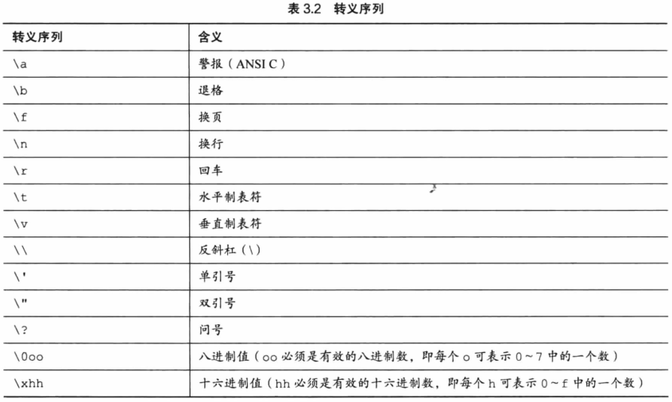

# 第三章 复习题

参考程序见同级 review 文件夹

## Question 1


答案：

| 选项  | 数据类型  |
|-----|-------|
| a   | int   |
| b   | float |
| c   | char  |
| d   | int   |

> - 人口应用整型表示，本机 int/long 型最大值为 21,4748,3647，绝对满足一个国家/地区的人口表示
> - 价格应用浮点型表示，本机 float 型最大值为 340282346638528859811704183484516925440.000000，远远够用了

## Question 2


答案：

- int 和 long 的位数不同的操作系统中，int 的最大值不满足要表示的数据，而 long 的最大值可以满足
- 要表示一个很大的整数，同时要提高程序可移植性，那么 long 在任何系统中都至少是 4 个字节会是一个合适的选择，不然在 64 位系统定义的
  int 型（4 个字节）到 32 位系统（2 个字节）上可能会不兼容

## Question 3


答案：

- `int32_t` 正好 32 位
- `int_least32_t` 至少 32 位
- `int_fast32_t` 最快的 32 位

> 建议只用 `int32_t`，不多不少刚刚好，不纠结

## Question 4


答案：

| 常量     | 类型    | 含义                   |
|--------|-------|----------------------|
| '\b'   | char  | char 类型常量，但存储为 int 型 |
| 1066   | short ||
| 99.44  | float ||
| 0XAA   | short | 十六进制格式的整型            |
| 2.0e30 | float ||

> `0XAA` 的十进制值为 170

## Question 5


答案：

```c
#include <stdio.h>
int main(void) {
    float g, h;
    float tax, rate;

    // 给 rate 赋初值
    rate = 0.8;
    g = 1.0e21;
    tax = rate * g;
    // 使用 h 变量
    h = g + tax;

    printf("%f %f %f %f", g, h, tax, rate);
    return 0;
}
```

## Question 6


答案：

| 常量        | 类型     | 转换说明（%转换字符） |
|-----------|--------|-------------|
| 12        | short  | %hd         |
| 0X3       | short  | %#hX        |
| 'C'       | char   | %c          |
| 2.34E07   | double | %f          |
| '\040'    | char   | %c          |
| 7.0       | double | %f          |
| 6L        | long   | %ld         |
| 6.0f      | float  | %f          |
| 0x5.b6p12 | float  | %f          |

## Question 8


答案：

| 变量    | 转换说明符 |
|-------|-------|
| imate | %d    |
| shot  | %ld   |
| grade | %c    |
| log   | %f    |

## Question 9


答案：

- `ch = '\r';`
- `ch = 13;`
- `ch = '\015';`
- `ch = '\x0d';`

## Question 10


## Question 11


答案：见下图：

